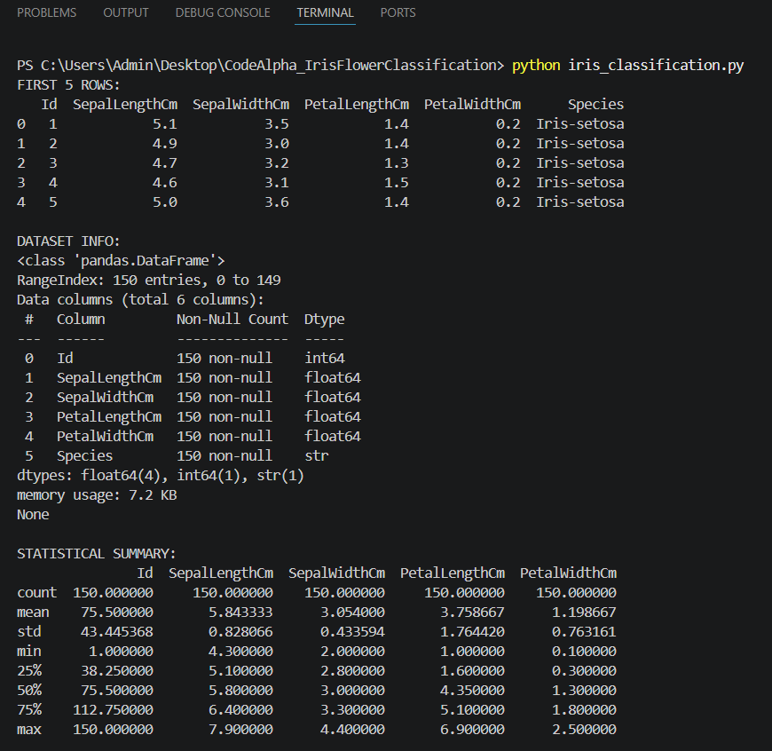
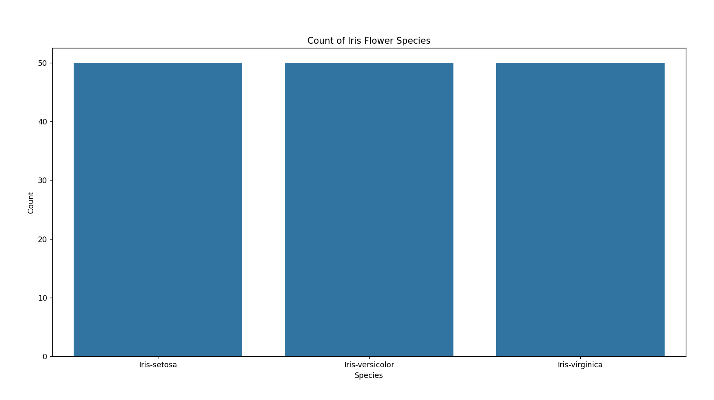
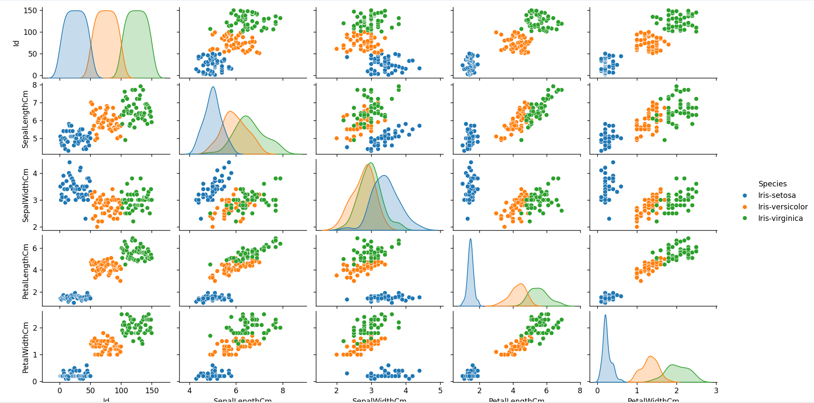
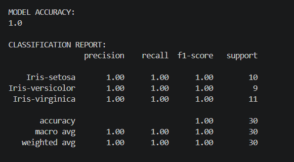
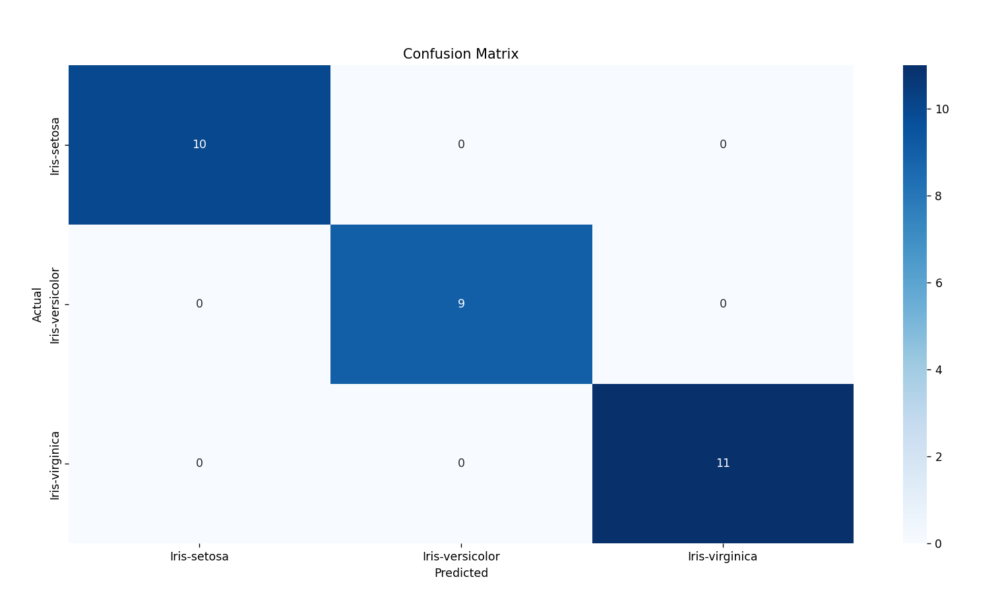

# Iris Flower Classification using Machine Learning

## Project Overview

This project is a Machine Learning classification model built using the Iris flower dataset. The model predicts the species of an Iris flower based on features such as sepal length, sepal width, petal length, and petal width.

The project demonstrates the complete Machine Learning workflow including:
- Data Loading
- Exploratory Data Analysis (EDA)
- Data Visualization
- Data Preprocessing
- Model Training
- Prediction
- Model Evaluation

## Technologies Used

- Python
- Pandas
- NumPy
- Matplotlib
- Seaborn
- Scikit-learn

## Dataset Information

The Iris dataset contains 150 flower samples from three different species:
- Iris-setosa
- Iris-versicolor
- Iris-virginica

Features used:
- Sepal Length
- Sepal Width
- Petal Length
- Petal Width

## Machine Learning Algorithm

The project uses the K-Nearest Neighbors (KNN) classification algorithm to classify flower species based on flower measurements.

## Project Workflow

1. Imported required libraries
2. Loaded the dataset
3. Performed Exploratory Data Analysis
4. Visualized the dataset using graphs
5. Removed unnecessary columns
6. Split dataset into training and testing sets
7. Trained the KNN model
8. Predicted flower species
9. Evaluated model accuracy
10. Generated confusion matrix

## Model Accuracy

The Machine Learning model achieved high accuracy on the test dataset.

## Output Screenshots

### Dataset Output

---

### Countplot Visualization

---

### Pairplot Visualization

---

### Accuracy Output

---

### Confusion Matrix

